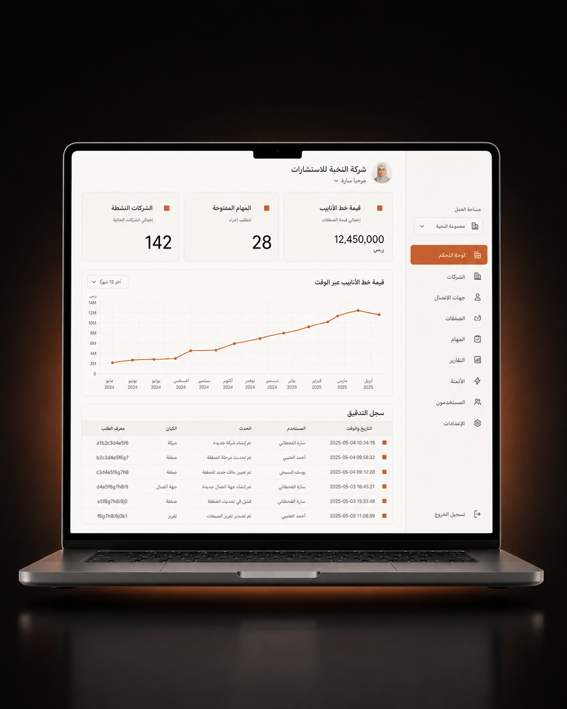

# Abubkr Abbas — Portfolio & CV

Personal portfolio and CV site for **Abubkr Abbas Elkhider Mohammed**, AI-Assisted App Developer based in the UAE.

## Live Site

**https://portfolio-zrgz.onrender.com** — deployed on [Render](https://render.com) as a static site.

| Path | Page |
|------|------|
| `/` | Portfolio landing page |
| `/cv` | Full professional CV (rewrite of `/cv.html`) |

## Structure

| File | Description |
|------|-------------|
| `index.html` | Portfolio landing page — editorial layout, EN/AR toggle |
| `landing.css` / `landing.js` | Landing page styles & language toggle / scroll reveal |
| `cv.html` | Full professional CV — EN/AR, print-to-PDF ready |
| `style.css` / `script.js` | CV page styles & interactions (theme, language, accent colour) |
| `render.yaml` | Render deploy config (static site) |

## Images

The landing page uses four image slots. Each is a `div.img-slot`; drop an `` **inside** it and the
placeholder frame and label disappear automatically.

| File | Slot | Ratio |
|------|------|-------|
| `portrait.png` | Hero portrait (cutout, sits on the green circle) | 3:4 |
| `munjaz.png` | Project 01 — Munjaz | 4:5 |
| `alsaab.png` | Project 02 — Alsaab | 4:5 |
| `nilesoft.png` | Project 03 — Nilesoft AI CRM | 4:5 |

```html
<div class="img-slot" data-label="04 · NILESOFT">
    
</div>
```

## Local Development

Open `index.html` in a browser, or serve the folder:

```bash
python -m http.server 5173
```

## Deploy to Render

Render is connected to this repo and auto-detects `render.yaml`. Pushing to `master` triggers a deploy.

## License

© 2026 Abubkr Abbas Elkhider Mohammed. All rights reserved.
